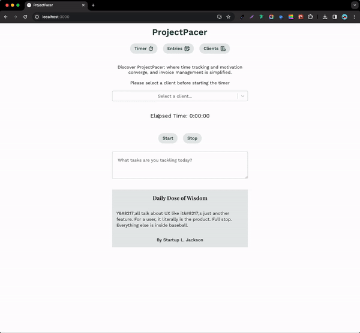

# ProjectPacer

## Overview

**ProjectPacer** is a web-based application crafted specifically for freelancers, aiming to enhance their productivity by providing a way to track time spent on various projects and tasks. 

The app integrates a timer with start and stop functionalities, invoicing based on tracked hours, and a motivational quotes feature to inspire users throughout their workday. Additionally, ProjectPacer allows users to add detailed comments to their time entries, ensuring a comprehensive understanding of tasks completed during each tracked period.

### Preview




### Problem

Managing multiple projects and tasks can often lead to inefficiencies and inaccuracies in time tracking for freelancers, affecting overall productivity. The administrative burden of creating invoices and tracking their status further complicates the workflow. ProjectPacer addresses these challenges by offering a solution that not only simplifies time tracking and invoice management but also boosts motivation through curated inspirational quotes.

### User Profile

ProjectPacer is designed for a freelancer who needs an efficient tool for managing their time, generating invoices, and seeking motivation. This initial version focuses on single-user functionality.

### Features

- **Time Tracking with Comments:** Enables time tracking for tasks with the ability to add comments detailing work completed.

- **Time Entries Management:** Offers functionalities to view, edit, and select time entries for invoicing, including detailed comments.

- **Invoice Generation and Management:** Facilitates the creation of invoices from selected time entries, customization of invoice details, tracking of invoice statuses (draft, sent, paid, late), and the ability to export as PDF.

- **Motivational Quotes:** Displays real-time motivational quotes from a third-party API to inspire and support users during their work.

- **Data Export:** Allows users to export time tracking and invoice data for record-keeping and analysis.

## Implementation

### Tech Stack

- **Frontend:** React.js, SASS, and React Router.
- **Backend:** Node.js, Express for server-side logic, MySQL database for data storage.
- **Libraries:** jsPDF for PDF generation, axios for API requests.

### APIs

- Quotes on Design - https://quotesondesign.com/api/

### Sitemap

- **Timer Page:** Central hub for time tracking, viewing quotes, and adding comments to tasks.
- **Time Entries Page:** Allows management and review of all time entries and can select specific time entries to create invoice.
- **Invoices Page:** Handles the creation, review, and status management of invoices. You can click to download PDF file. 


### Data

- **Time Entries:** Enhanced to include start/end times, duration, task-specific comments, and invoicing status.
- **Clients:** Detailed with ID, associated time entries.

### Endpoints

#### **1. Clients**

- **GET `/clients`**: Get all clients.
- **POST `/clients`**: Add a new client.
- **GET `/clients/:id`**: Get client by ID.
- **PATCH `/clients/:id`**: Edit client by ID.
- **DELETE `/clients/:id`**: Delete client by ID.
- **GET `/clients/:id/timers`**: Get all entries related to client with ID.

```jsx
{
        clientid: 1,
        name: 'Alice Johnson',
        email: 'alice@example.com',
        address: '1234 Main St',
        phone: '604-441-1001',
    }
```

#### **2. Timers**

- **GET `/timers`**: Get all timers.
- **POST `/timers`**: Start a new timer.
- **GET `/timers/:id`**: Get timer details.
- **PATCH `/timers/:id`**: Edit timer details.
- **DELETE `/timers/:id`**: Delete timer details.

```jsx
{
    timerid: 3,
    starttime: '2024-02-03 13:00:00',
    endtime: '2024-02-03 15:30:00',
    duration: 9000,
    description: 'Design phase for Project C',
    clientid: 3,
    invoiced: false,
  }
```


### Auth

ProjectPacer only supports a single user without authentication.


## Installation

Here’s how you can get ProjectPacer up and running on your local development machine.

### Prerequisites
Before you begin, ensure you have the following installed on your system:

- Node.js 
- npm (comes with Node.js)
- MySQL 

### Installation Steps
**1. Clone the Repositories**

Start by cloning the ProjectPacer repository to your local machine.

```jsx
git clone https://github.com/abloper24/project-pacer
```
```jsx
git clone https://github.com/abloper24/project-pacer-backend
```

**2. Install Node Dependencies**

Install the necessary Node.js dependencies for both the frontend and backend.

```jsx
npm install
```

**3. Set Up the Database**

Create a MySQL database and user for the application and load the provided seed data.

```jsx
CREATE DATABASE projectpacer;
USE projectpacer;
SOURCE path_to_project_pacer_database_seed.sql;
```

**4. Configure the Environment**

Set up your environment variables.

- Backend .env file
```jsx
DB_HOST=localhost
DB_USER=your_username
DB_PASS=your_password
DB_NAME=projectpacer
```
**5. Run migrations and seed files**

```jsx
npx knex migrate:rollback
npx knex migrate:latest
npx knex seed:run
```

**6. Start the Backend Server**

Navigate to the backend directory and start the server.

```jsx
node --watch index.js
```

The backend server should now be running on http://localhost:8080.

**7. Start the Frontend Application**

In a new terminal, navigate to the frontend directory and start the React app.

```jsx
npm start
```

The application should open in your browser at http://localhost:3000.

**7. Verify the Setup**

Ensure that the frontend communicates with the backend correctly and that you can access the database.

**8. Personalize Invoice Data**

In the frontend on the invoices page, change the logo and your business data to show in the invoice pdf. 
